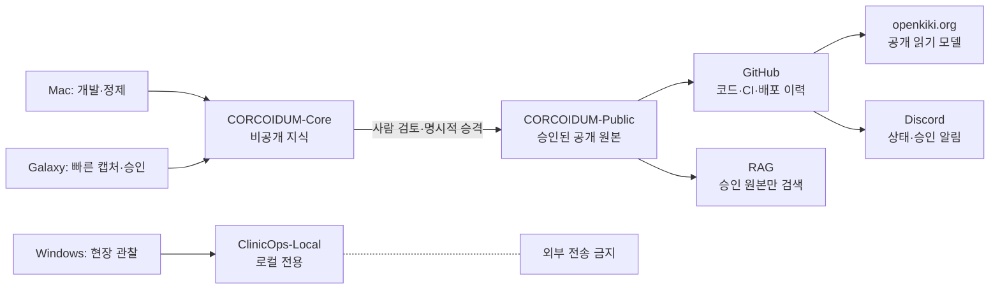
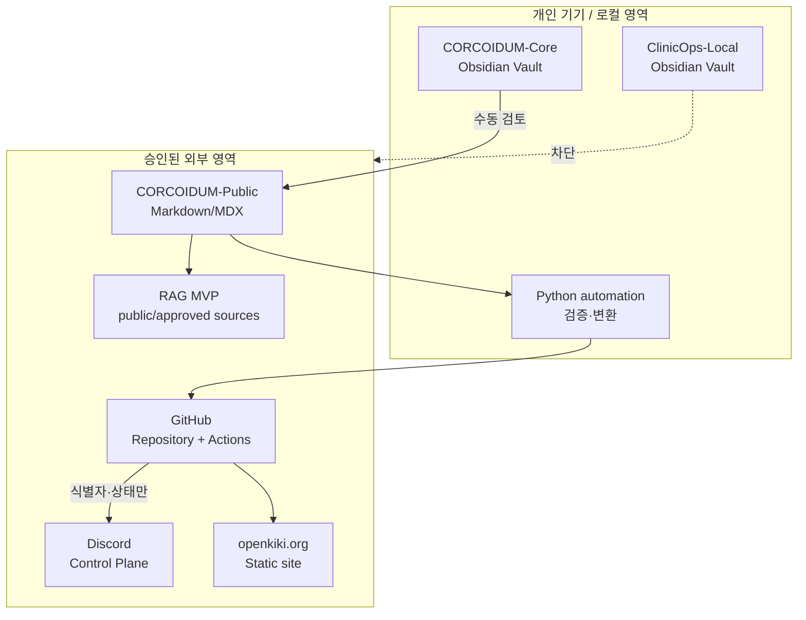

# CORCOIDUM OS Architecture Charter

**상태:** Phase 7 retrieval-only MVP 완료 (외부 CI·Discord·LLM provider 검증 대기)
**갱신일:** 2026-07-10
**적용 범위:** 개인 지식 관리, 개발, 자동화, 공개 포트폴리오

## 1. 목적과 설계 원칙

CORCOIDUM OS는 현장의 문제를 사람 중심의 시스템 개선으로 바꾸는 개인 운영체제다. 이 저장소는 실제 의료 정보를 관리하는 시스템이 아니며, 임상 판단·의료기록·환자 정보를 처리하지 않는다.

우선순위는 다음과 같다.

1. 보안 경계가 편의성보다 우선한다.
2. 검증 가능한 단순성이 복잡한 자동화보다 우선한다.
3. 한 정보 유형에는 한 개의 권위 원천만 둔다.
4. 공개·외부 전송은 명시적 승인 후에만 허용한다.
5. 자동화는 관찰 가능하고, 재실행 가능하며, 수동 대체 절차를 가진다.

## 2. 시스템 경계

`ClinicOps-Local`은 논리적·물리적으로 다른 Vault에 두며 외부 연결을 만들지 않는다. 실제로 식별 가능 정보가 발견되면 처리·전송을 중단하고 별도 승인 없이 이 저장소에 옮기지 않는다.

## 3. 컨테이너 구조

## 4. 책임과 권위 원천

| 정보 유형 | 권위 원천 | 허용 소비자 | 금지 소비자 |
| --- | --- | --- | --- |
| 비식별 현장 SOP·마찰 기록 | ClinicOps-Local | 로컬 Obsidian, 로컬 수동 검토 | GitHub, Discord, 클라우드, LLM, 공개 사이트 |
| 개인 학습·초안·프로젝트 맥락 | CORCOIDUM-Core | 개인 동기화, 수동 검토 | 자동 공개, 공개 RAG |
| 승인된 공개 콘텐츠 | CORCOIDUM-Public | GitHub, 사이트, 공개 RAG | 민감·비승인 입력 |
| 코드·테스트·ADR·배포 이력 | GitHub | CI/CD, Discord 상태 알림 | ClinicOps 원본 저장 |
| 캡처 상태·알림·승인 요청 | Discord | 운영 확인 | 민감 원문·비밀값 |

전체 매트릭스는 [source-of-truth.md](../governance/source-of-truth.md)에 있다.

## 5. 보안 분류와 기본 거부

보안 등급이 없거나 모순되면 처리하지 않는다. `S3_RESTRICTED`는 외부 경로가 0개여야 한다. 상세 규칙은 [security-classification.md](../governance/security-classification.md)를 따른다.

## 6. 콘텐츠 수명주기

`capture → distill → connect → build → review → publish → maintain → archive`

공개 경로에서는 `draft → review → approved → published → archived`의 상태 전이만 허용한다. AI 출력은 항상 `_AI_Staging`에서 시작하며, 사람의 승인이 없으면 승격·발행할 수 없다. 자세한 전이와 수동 대체 절차는 [content-lifecycle.md](../governance/content-lifecycle.md)에 기록한다.

## 7. 동기화·백업 원칙

동기화는 작업 사본을 맞추는 과정이고, 백업은 독립적인 복구 사본이다. 데이터셋마다 동기화 방법은 하나만 사용한다. `ClinicOps-Local`은 외부 동기화에서 제외한다. [sync-backup-policy.md](../governance/sync-backup-policy.md)를 준수한다.

## 8. 초기 기술 결정

- 공개 웹: Vite + TypeScript + 정적 빌드 (Phase 5)
- 자동화: Python 표준 라이브러리를 우선하고, 필요한 경우에만 작은 의존성을 도입 (Phase 1+)
- 구조화 저장소: 초기에는 Markdown 파일과 Git을 사용하며 데이터베이스는 도입하지 않음
- RAG: 승인된 공개/명시적 승인 원본에 한정한 교체 가능한 로컬 우선 MVP (Phase 7)

결정 근거와 재검토 기준은 [ADR-0001](../adr/0001-small-maintainable-stack.md)에 있다.

## 9. 위험 관리

초기 위험·완화책·중단 조건은 [risk-register.md](risk-register.md)에 있다. 모든 외부 통합은 환경 변수와 비식별 요약만 사용하며, 비밀값은 로그와 소스에서 제외한다.

## 10. Phase 1·2 완료 기준

Phase 1을 시작하기 전 다음을 확인한다.

- [x] 각 컴포넌트에 책임 소유자가 있다.
- [x] `S3_RESTRICTED`의 외부 경로가 문서와 모델에서 제거됐다.
- [x] 동기화와 백업이 분리되어 있다.
- [x] 세 Vault의 합성 예시 구조, 공통 스키마, Obsidian 템플릿을 만들었다.
- [x] 메타데이터·Vault 경계·고신뢰 민감 패턴을 검사하는 표준 라이브러리 검증기를 만들었다.
- [x] 합성 노트와 단위 테스트로 기본 거부 규칙을 확인했다.
- [x] 공개 후보의 privacy review checklist와 review 증적 규칙을 정의했다.
- [x] 승인 후 수정된 Public 노트가 이전 검토 증적을 재사용하지 못하도록 검사한다.

Phase 3·4에서는 Public Vault 검증과 승인 콘텐츠 index 생성을 CI gate에 연결했고, Phase 5에서는 그 index만 읽는 Vite 정적 UI와 공개 경로를 구현했다. Phase 6에서는 비식별 상태 보고·선택적 Discord 알림·주간 검토 자동화를 추가했다. Phase 7에서는 외부 LLM 호출 없이 승인된 공개 출처만 검색·인용하는 retrieval-only Wiki MVP를 추가했다.
