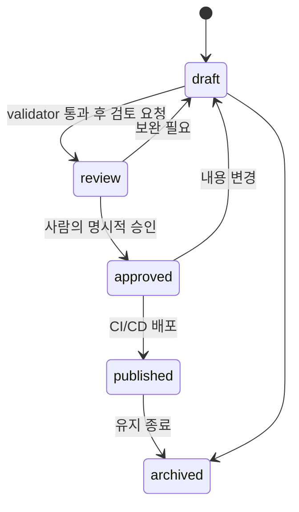

# 콘텐츠 수명주기와 승인 규칙

## 작업 흐름

`Capture → Distill → Connect → Build → Review → Publish → Maintain → Archive`

공개 후보는 Core에서 작성한 뒤, 민감 내용을 제거하여 Public에 **새 문서**로 승격한다. Core 원문에 대한 자동 복사·자동 공개는 허용하지 않는다.

## 발행 상태 전이

- `draft`, `review`는 production 배포 대상이 아니다.
- `review` 이상 Public 노트에는 검토 요청 시각, privacy 검토자·시각·통과 결과, 검토 버전을 기록한다.
- `approved`에는 승인자와 승인 시각을 기록한다.
- 배포 뒤를 포함해 내용이 바뀌면 다시 `draft`로 되돌리고, 새 검토를 요청한다.
- AI 생성물은 항상 `_AI_Staging`에 저장하고, 신뢰할 수 있는 지식처럼 표시하지 않는다.

Public 노트의 상세 checklist와 변경 이력 규칙은 [public-content-review.md](public-content-review.md)를 따른다.

## 수동 대체 절차

자동 발행이 멈춰도 승인된 Markdown을 로컬에서 검증하고, Pull Request를 통해 수동 배포할 수 있다. 오류·위반이 있으면 마지막 정상 Git 릴리스로 롤백한다.
